# terraform-example-security-hub
Minimun example of AWS Security Hub provisioned by terraform

## Architecture


### Event type
There are three types of event send from Security Hub.

#### 1️⃣ Security Hub Findings - Imported
All events from Security Hub is include in this type. (Precisely, every BatchImportFindings and BatchUpdateFindings request)
You can filter these events in the EventBridge rules.

#### 2️⃣ Security Hub Findings - Custom Action
Findings associated with custom actions created in Security Hub will be sent.

Note that currently custom actions cannot be executed automatically, and are limited to manual operation from the console (select the findings you want to send and press the action button).

#### 3️⃣ Security Hub Insight Results
This type is almost same as  `2️⃣ Security Hub Findings - Custom Action`. 

This type is triggered when you select the insight results and trigger custom actions. 
 
## Code structure
```
terraform
├── env
│   └── example
│       ├── main.tf
│       └── provider.tf
└── module
    ├── notification
    │   ├── data.tf
    │   ├── event.tf
    │   ├── outputs.tf
    │   ├── sns.tf
    │   └── variables.tf
    └── security_hub
        ├── outputs.tf
        ├── security_hub.tf
        └── variables.tf
```
